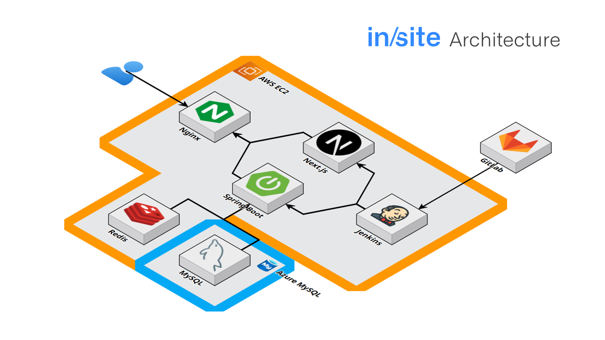
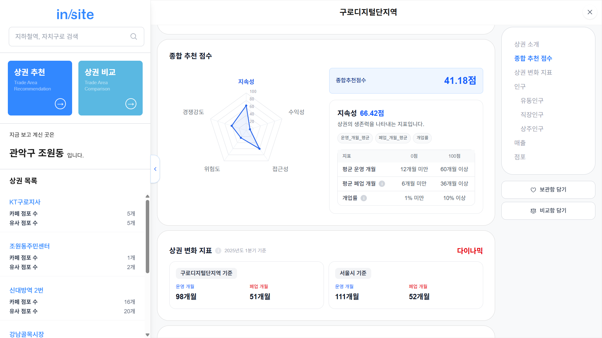
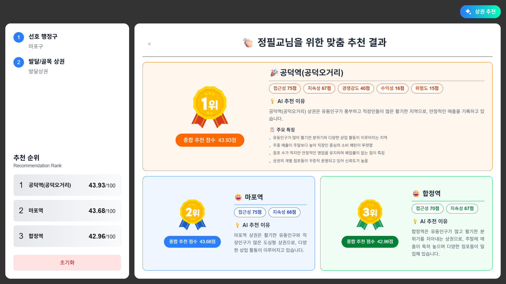
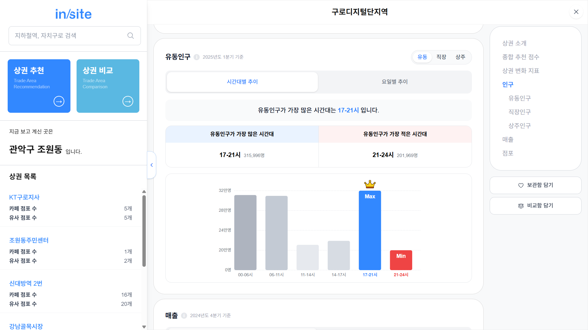
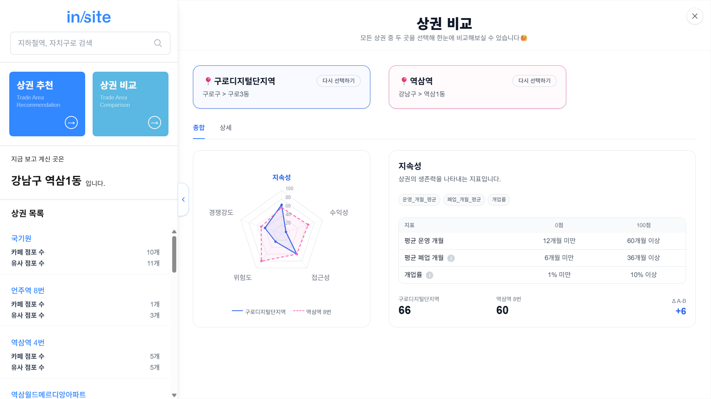

  <picture>
    
  </picture>

<h1 align="left">Insite: 상권분석 플랫폼</h1>
<h3 align="left">FROM INSIGHT TO SITE - POWERED BY DATA.</h3>

> 인구와 소비 데이터를 포함한 다양한 도시 데이터와 상권 분석 모델을 기반으로 창업자가 최적의 입지를 찾을 수 있도록 상권추천·비교·분석 서비스를 제공하는 플랫폼 입니다.

**참여인원**: 5명  
**수행기간**: 2025. 08. 25 - 2025. 10. 02 (7주)  
**수행배경**: 삼성청년SW·AI아카데미 2학기 특화 프로젝트

---

## Our Team

<table>
  <tr>
      <td width="25%" align="center">
       
      <strong>천광민</strong> 
      Front-end | 팀장 
    </td>
    <td width="25%" align="center">
       
      <strong>남다현</strong> 
      Front-end 
    </td>
  </tr>
    <tr>
    <td width="25%" align="center">
       
      <strong>정필교</strong> 
      Back-end | DB 
    </td>
    <td width="25%" align="center">
       
      <strong>홍지훈</strong> 
      Infra 
    </td>
  </tr>
    </tr>
    <tr>
    <td width="25%" align="center">
       
      <strong>김범주</strong> 
      상권분석모델 
    </td>
        <td width="25%" align="center">
       
      <strong>김재유</strong> 
      상권분석모델 
    </td>
  </tr>
</table>

---

## Problem Definition

- 예비 창업자의 70% 이상이 **입지 선정에 어려움**을 겪음  
- 경험 부족으로 인해 **단순 인기 지역 위주 선택** → 폐업률 증가  
- 단일 지표 기반이 아닌, **다차원 데이터 분석 기반의 의사결정** 필요

---

## Our Solution

- **맞춤형 상권 추천**  
  - 사용자가 직접 선택한 `자치구`, `상권 유형(발달/골목)` 등을 반영  
  - 단순 인기 지역이 아닌, **개인 상황에 최적화된 상권** 제안

- **다차원 분석 점수**  
  - 인구, 매출, 경쟁, 상권 변화 추세 등 종합 분석 → **100점 만점 종합 점수**  
  - 단일 지표 의존에서 벗어나 객관적이고 신뢰도 높은 결과 제공

- **설득력 있는 결과 제공**  
  - 점수만 제시하는 것이 아니라, **상권 분위기 + 추천 이유** 함께 제공  
  - 사용자가 결과를 이해·납득하고 실제 의사결정에 활용 가능

---

## Deliverables

<ul>
  <li>
    <a href="project-deliverable/user-manual.pdf" target="_blank">
      📄 유저 매뉴얼.pdf
    </a>
  </li>
  <li>
    <a href="project-deliverable/porting-manual.pdf" target="_blank">
      📄 포팅 매뉴얼.pdf
    </a>
  </li>
  <li>
    <a href="project-deliverable/final-report.pdf" target="_blank">
      📄 최종발표 자료.pdf
    </a>
  </li>
  <li>
    <a href="project-deliverable/mid-term-report.pdf" target="_blank">
      📄 중간발표 자료.pdf
    </a>
  </li>
</ul>

---

## System Architecture

  

---

## Key Features

### 1. 상권 평가 모델
- 지속성·수익성·접근성·위험도·경쟁강도 등을 정량화하여 **100점 만점 종합 점수** 제공  
- 주요 지표: 유동인구, 상주인구, 직장인구, 업종분포, 상권 변화지표 등  

### 2. AI 상권 추천
- 선호 행정구, 상권 유형을 조건으로 입력  
- 종합점수를 기반으로 **Top 3 상권 추천**

### 3. 상권 상세 조회
- 시간대별 인구 변화 및 분포 
- 상권 유형 및 창업 생애주기 분석  

### 4. 상권 비교 보드
- 2개 상권의 핵심 지표를 **한눈에 비교**   

---

## Expected Impact

- 예비 창업자가 **데이터 기반 입지 선정** 가능  
- 실패 확률을 낮추고 창업 성공률 향상에 기여  

---

ⓒ 2025. SAMSUNG SW·AI ACADEMY FOR YOUTH 
Code Ident: S13P21E203
